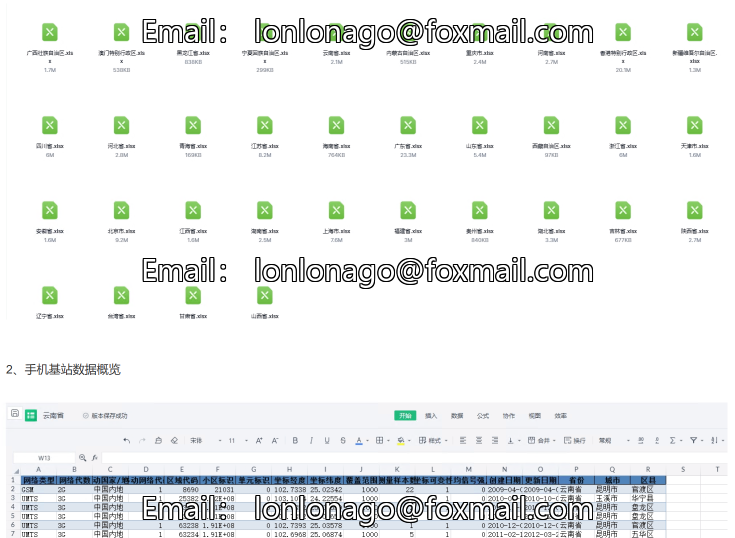

# National Provincial, Municipal, and County-Public Mobile Base Station Data (2006-2025.3)

124.5MBrar  
Mobile base stations are an integral part of modern communication networks, providing infrastructure for a wide range of communication services.  
As the digital process continues to advance, the construction and layout of mobile base stations play a crucial role in optimizing network quality and enhancing communication service levels. This data sharing can help analyze the development and optimization of mobile communication networks.  
This data is for the provinces, cities, and counties of China, derived from OpenCelliD base station data, covering the years from 2006 to March 2025.  
I. Data Introduction  
Data Name: National Provincial, Municipal, and County-Public Mobile Base Station Data  
Data Year: 2006-March 2025  
Data Range: Provinces, cities, and districts/counties across the country  
Data Format: Excel  
Data Source: OpenCelliD  
II. Data Indicators  
Network Type, Network Generation, Mobile Country/Region, Mobile Network Code, Area Code, Cell Identifier, Unit Identifier, Coordinate Longitude, Coordinate Latitude, Coverage Range, Measured Samples Count, Coordinate Variability, Mean Signal Intensity, Created Date, Last Updated Date, Province, City, District/County  
III. References  
[1] Cao Xiaojing, Liang Yuemei, Yu Ruqin, et al. Digital Infrastructure Construction and Industry Resilience - Empirical Analysis Based on Industry Recovery Capacity Data [J]. Journal of Quantitative Economics and Technological Economics, 2024, 41(11): 112-131.  
[2] Chen Qiangyuan, Cui Yuyang, Cai Weixing. Digital Government Construction and Urban Governance Quality: Evidence from Public Safety Departments [J]. Journal of Quantitative Economics and Technological Economics, 2024, 41(11): 132-154.  
IV. Data Overview  
1. Overview of Chinese Provinces, Municipalities, and County Mobile Base Station Data Files

## Images

Here is a pay link on Stripe ( https://buy.stripe.com/3cs8yP7sY87d0vu9AB ). Please contact me lonlonago@foxmail.com after funding $89, and I will send you a complete data files , thank you!

